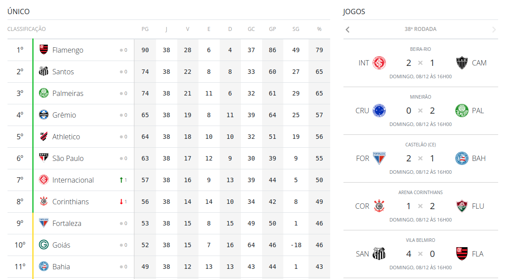

# Football Table Web Components 

> Web component repository for use in Conceptho web projects



## Compatibility

**IE11 and below not supported.**

## Usage

- **`<script src="https://unpkg.com/vue"></script>`**: Include the Vue library.
- **`<script src="https://romulo1984.github.io/football-table/football-table.min.js"></script>`**: Include the component file.
- **`<football-table></football-table>`**: Include the component like any other HTML component.
- **`year="2019" league="30"`**: Pass the values to the component via attributes.


### Example
```html
<!--The vue is not incorporated by the web component, so it is necessary to import it. -->
<script src="https://unpkg.com/vue"></script>
<script src="https://romulo1984.github.io/football-table/football-table.min.js"></script>

<football-table
    year="2019"
    league="30"
    show-title="false"
    endpoint="http://localhost:3000/">
</football-table>
```

It works with async components as well - you can pass an async component factory function that returns a Promise, and the function will only be called when an instance of the custom element is created on the page:

### Properties

- `year`: Year of the league. Default is `2019`;
- `league`: League reference code. Default is `30`, referring to the Brazilian Serie A League, [See table with available leagues](#available-leagues);
- `show-title`: Display the league name at the top of the table. Default is `false`;
- `endpoint`: API endpoint that provides tables, matches and schedules data. This attribute is mandatory and has no default. [See UOL API Proxy.](#uol-api-proxy)


### Props notes

- All `props` declared in the Vue component are exposed on the custom element as its properties. Kebab-case props are converted to camelCase properties, similar to how they are converted in Vue.

- Setting properties on the custom element updates the props passed to the inner Vue component.

- Setting attributes on the custom element updates corresponding declared props. Attributes are mapped to kebab-case. For example, a prop named `someProp` will have a corresponding attribute named `some-prop`.

- Attributes that map to props declared with `type: Boolean` are auto-casted into boolean values in the following rules:

  - `""` or same value as attribute name: -> `true`

  - `"true"` -> `true`

  - `"false"` -> `false`

- Attributes that map to props declared with `type: Number` are auto-casted into numbers if the value is a parsable number.

## Available Leagues
- **Code 12**: Alemão
- **Code 13**: Amistosos
- **Code 28**: Baiano
- **Code 30**: Brasileirão
- **Code 34**: Carioca
- **Code 36**: Cearense
- **Code 39**: Copa América
- **Code 41**: Copa da Alemanha
- **Code 42**: Copa da França (não aparece)
- **Code 43**: Copa da Inglaterra
- **Code 44**: Copa da Itália
- **Code 48**: Copa do Brasil
- **Code 52**: Copa do Mundo
- **Code 54**: Copa do Mundo Feminina
- **Code 55**: Copa do Nordeste
- **Code 56**: Copa do Rei
- **Code 58**: Copa São Paulo
- **Code 59**: Copa Sul-americana
- **Code 60**: Eliminatŕias Africanas
- **Code 63**: Eliminatórias Asiáticas
- **Code 71**: Eliminatórias da Eurocopa
- **Code 72**: Espanhol
- **Code 76**: França
- **Code 77**: Gaúcho
- **Code 79**: Inglês
- **Code 81**: Italiano
- **Code 82**: Libertadores
- **Code 83**: Liga dos Campeões
- **Code 84**: Liga Europa
- **Code 86**: Mineiro
- **Code 87**: Mundial de Clubes
- **Code 103**: Paranaense
- **Code 104**: Paulista
- **Code 107**: Pernambucano
- **Code 110**: Recopa Sul-americana
- **Code 112**: Série B
- **Code 113**: Série C
- **Code 114**: Série D
- **Code 116**: Sul-americano Sub-20
- **Code 117**: Supercopa da Espanha
- **Code 118**: Supercopa da Europa
- **Code 119**: Supercopa da Inglaterra
- **Code 120**: Supercopa da Itália
- **Code 142**: Amistosos da Seleção Brasileira
- **Code 143**: Supercopa da Alemanha
- **Code 144**: Supercopa da França
- **Code 147**: Copa Suruga
- **Code 148**: Copa da Liga Francesa
- **Code 149**: Copa da Liga Inglesa
- **Code 160**: Liga das Nações
- **Code 161**: Flórida Cup

## UOL API proxy
This project does not provide the data access api, but it was all built based on UOL's api.

UOL does not make the api publicly available, using CORs to not allow other domains to have access. Below I write a simple example of code compatible with the design of this repository, but do it at your own risk and I am not responsible for misuse of third-party content.

```javascript
const express = require('express')
const axios = require('axios')
const app = express()
const port = 3000

const API_BASE = 'http://jsuol.com.br/c/monaco/utils/gestor/commons.js?file=commons.uol.com.br/sistemas/esporte/modalidades/futebol/campeonatos/dados'

app.get('/:year/:league', async (req, res) => {
    const { year, league } = req.params
    const URL = `${API_BASE}/${year}/${league}/dados.json`

    res.set({
        'Access-Control-Allow-Origin': '*',
        'Content-Type': 'application/json'
    })

    const { data } = await axios.get(URL)
    res.send(data)
})

app.listen(port, () => {
  console.log(`Example app listening at http://localhost:${port}`)
})
```

I won't explain each line of code, but basically it accesses the UOL api, passing the year and the corresponding league ID, sets some headers and returns the result. A simple proxy to get around the CORs restriction.

## How to contribute?

This project was not written using the best development techniques, so there is no ideal separation of responsibilities or even components. Feel free to make a fork of the repository and use it as you see fit, as I don't currently have time to receive contributions and improve the code.

## License

MIT
